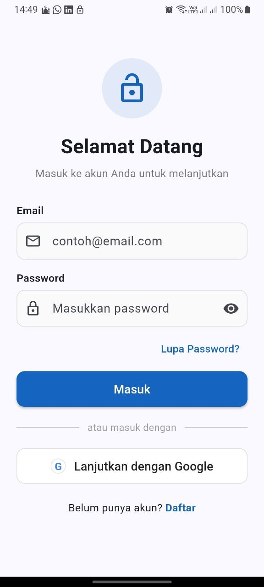
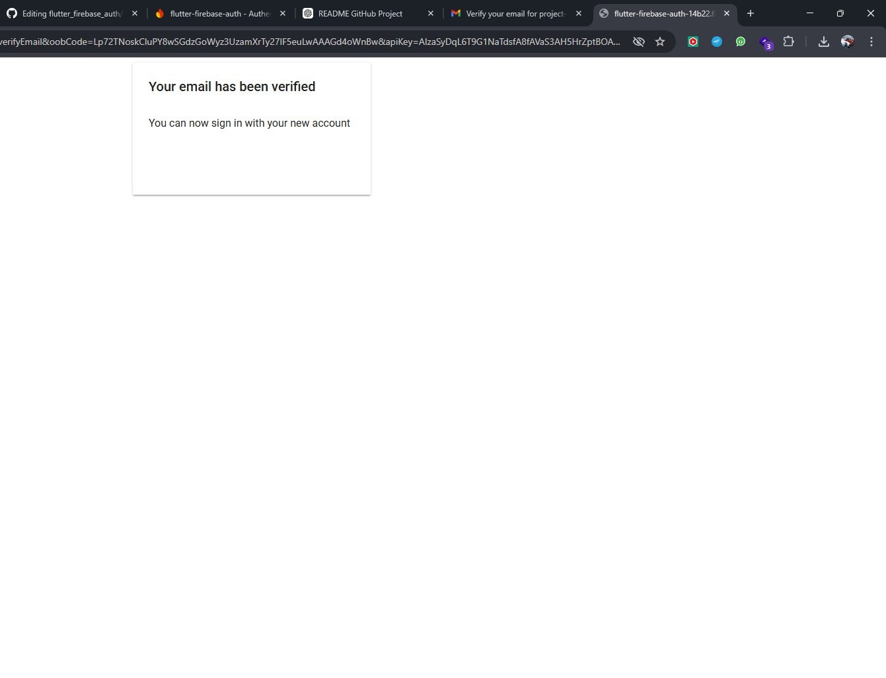
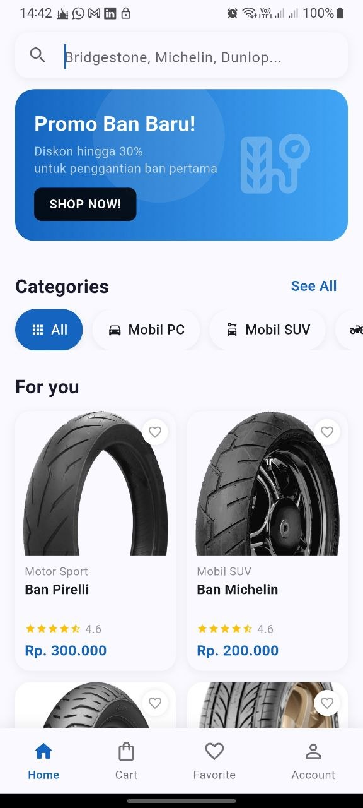
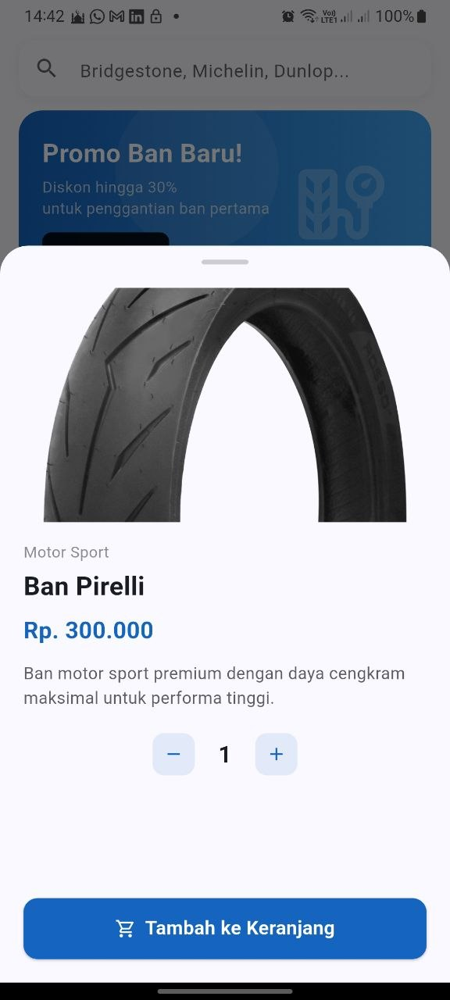
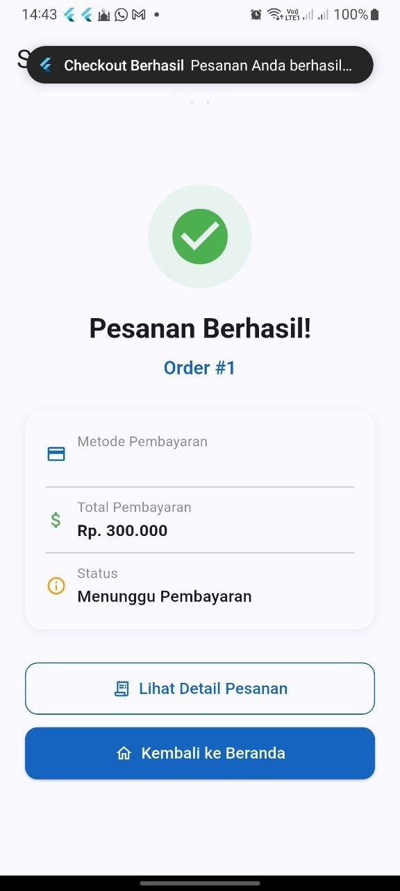
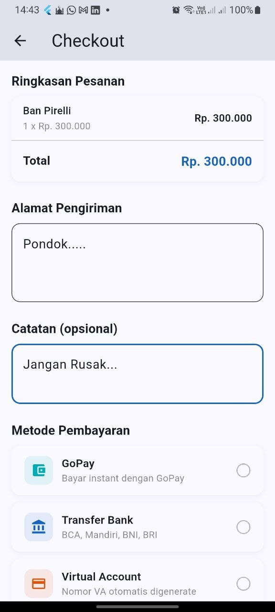
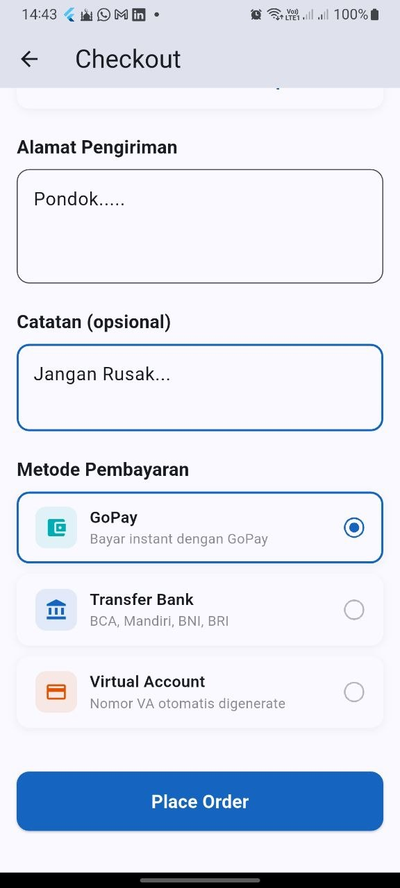
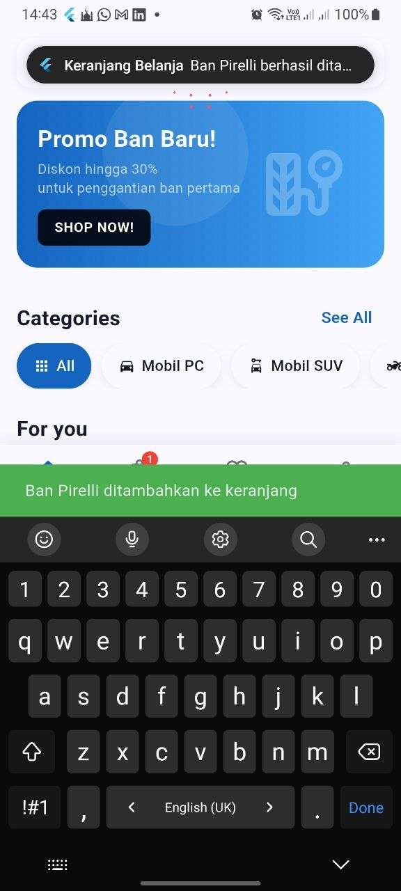
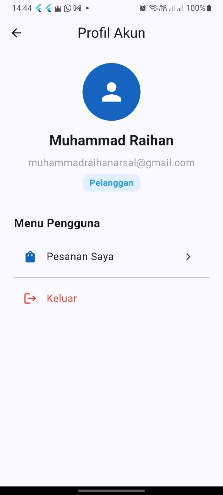
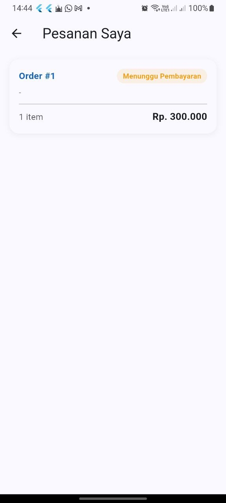

# UTS Pemrograman Mobile Lanjutan

## 📱 Aplikasi
**Aplikasi E-Commerce Toko Ban**

---

## 👨‍💻 Pengembang
### Muhamad Raihan Arsal  
**NIM:** 1125170132  
**Kelas:** TI SE KS 25  
**Program Studi:** Teknik Informatika  
**Konsentrasi:** Software Engineering  

---

## ⚙️ Tech Stack
Aplikasi ini dirancang menggunakan:

- **Flutter**  
  Sebagai Front-End untuk menerima respon dari backend dan mengirim input dari user.

- **Firebase**  
  Digunakan untuk autentikasi, termasuk verifikasi email dan login dengan Google.

- **Golang (Backend API)**  
  Sebagai backend untuk menghubungkan database dengan aplikasi frontend.

- **MySQL**  
  Sebagai database lokal untuk penyimpanan data.

---

## 📌 Deskripsi Singkat
Aplikasi ini merupakan platform e-commerce berbasis mobile untuk penjualan ban mobil dan motor, yang memungkinkan pengguna melakukan pembelian secara online dengan sistem autentikasi dan pengelolaan data yang terintegrasi.

---

## 📸 Alur Penggunaan Aplikasi (Screenshots)

### 1. Tampilan Awal Aplikasi
Tampilan ketika awal pertama kali aplikasi berjalan dan pengguna belum melakukan login.

  

### 2. Verifikasi Email
Tampilan halaman setelah proses login/register. Pengguna diwajibkan untuk memastikan email sudah terverifikasi.

  

### 3. Halaman Utama (Dashboard)
Setelah email terverifikasi, maka aplikasi langsung mengarahkan pengguna ke halaman utama (Dashboard) yang berisi katalog produk.

  

### 4. Detail Produk
Fitur di dalam aplikasi ketika user memasuki detail produk untuk melihat deskripsi barang.

  

### 5. Proses Pembelian & Keranjang Belanja
Ketika user melakukan pembelian barang di katalog, keranjang yang awalnya kosong sekarang sudah ada detail produk dan total harga di dalamnya. Selanjutnya user dapat melanjutkan ke proses *checkout*, memilih metode pembayaran, hingga pesanan berhasil dibuat.

  
  
  
  

### 6. Profil & Riwayat Pesanan
Pengguna dapat mengelola akun pada halaman profil dan melihat riwayat barang yang sudah dipesan.

  
  

